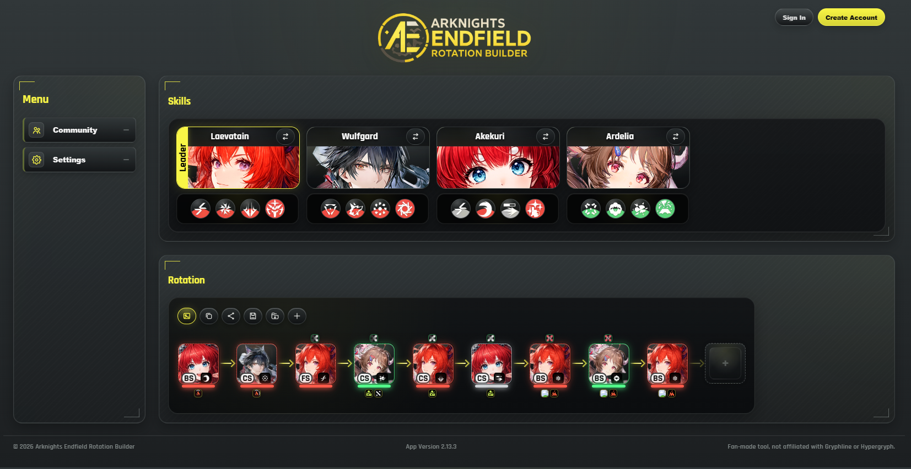

# Arknights Endfield Rotation Tool

Interactive web tool for building, visualizing, exporting, and sharing Arknights: Endfield team rotations.



## Live Demo

[Open the builder](https://slowmoslothy.github.io/Arknights-Endfield-Rotation-Tool/)

## Features

- Build a team with up to 4 operators.
- Empty team slots show a `+` button so new users can start immediately.
- Drag and drop skills into a snake-style rotation layout.
- Tap-friendly mobile controls for adding, moving, and removing skills.
- Skill tooltips with cooldown, energy, type, effects, buffs, and debuffs.
- Operator buff and enemy debuff indicators on the rotation.
- Compact share codes for team + rotation setups.
- Share links with the setup embedded in the URL hash.
- Export rotation images with a builder-address watermark.
- Account-based private saves, usernames, and avatar profiles through `My Rotations`.
- Browse, filter, sort, inspect, preview, link, and like approved Community rotations with visible author usernames and avatars, then submit your current setup for review when signed in.
- LocalStorage auto-save for team, rotation, UI settings, and operator states.
- Optional Enemy panel controlled from `js/state/appState.js`.

## Sharing Builds

Use the sidebar buttons:

- Top-right `Sign In` and `Create Account` buttons open the account flow.
- `Profile` lets signed-in users edit their username and avatar.
- `My Rotations` lets signed-in users inspect saved rotations, edit title/description, overwrite a save with the current rotation, delete it, or submit it for Community review.
- `Copy Setup` copies a short setup code.
- `Copy Link` copies a URL that loads the team and rotation automatically.
- `Load Setup` accepts either a setup code or a full share link.
- The diskette button in the Rotation toolbar opens a quick save form for `My rotations` or a Community review submission.
- Community rotation cards and detail views can copy a direct link to an approved rotation.

Share links use this format:

```text
https://slowmoslothy.github.io/Arknights-Endfield-Rotation-Tool/#setup=AERT2:...
```

Approved Community rotations can also be opened directly:

```text
https://slowmoslothy.github.io/Arknights-Endfield-Rotation-Tool/#community=ROTATION_ID
```

Current share codes use the compact `AERT2:` format. Older `AERT1:` codes can still be imported.

## Exporting Images

Use `Export Rotation` to download the current rotation as a PNG.

Important: browsers block image export from direct `file://` pages when local images are drawn into a canvas. For local testing, start a small web server instead:

```bash
python -m http.server 4173
```

Then open:

```text
http://localhost:4173/index.html
```

## Configuration

Feature flags and app-level values live in:

```text
js/state/appState.js
```

Useful options:

```js
let showEnemyPanel = false;
let useSupabaseOperators = true;
let builderWatermarkUrl = "https://slowmoslothy.github.io/Arknights-Endfield-Rotation-Tool/";
```

Set `showEnemyPanel` to `true` to show the Enemy section again.
Set `useSupabaseOperators` to `false` to force the local operator files instead of Supabase.

## Supabase Database

Supabase setup files live in:

```text
supabase/
  schema.sql
  community_rotations.sql
  community_rotations_review.sql
  user_rotations.sql
  admin_panel.sql
  seed_operators_basic.sql
tools/
  exportOperatorsForSupabase.js
```

Run `supabase/schema.sql` first in the Supabase SQL Editor. It creates:

- `operators` for the operator base data, including `star` and `operator_class`.
- `operator_skills` for all skills linked to their operator.
- public read policies for both tables.

For a quick import of only the operator rows, run `supabase/seed_operators_basic.sql`.

For the full import with operators, skills, and preserved raw JSON data, generate the SQL from the current local data:

```bash
node tools/exportOperatorsForSupabase.js --stdout > supabase/seed_operators.sql
```

Then paste/run `supabase/seed_operators.sql` in the Supabase SQL Editor after the schema.

The frontend must only use the Supabase publishable/anon key. Never put a Supabase `service_role` key into browser code.
When `useSupabaseOperators` is enabled, the app loads `operators` and `operator_skills` from Supabase on startup and falls back to the local JS files if loading fails.

### Community Rotations

To enable the Community modal, run this file in the Supabase SQL Editor:

```text
supabase/community_rotations.sql
```

It creates `community_rotations` and the access rules:

- signed-in users can submit rotations for review.
- visitors can only read rotations that are public, approved, and not hidden.
- visitors can increment view and like counters through restricted database functions.
- pending submissions stay hidden until you approve them in Supabase.

### User Accounts And Private Rotations

To enable account-based saves, run this file in the Supabase SQL Editor after the Community setup:

```text
supabase/user_rotations.sql
```

It creates `user_profiles`, the public `avatars` storage bucket, and `user_rotations` with row-level security:

- new accounts store a public username during registration.
- public usernames and avatars can be shown on approved Community rotations.
- signed-in users can update their own username and avatar.
- signed-in users can save private rotations.
- users can only read, update, and delete their own saved rotations.
- saved rotations can be submitted to Community review later.
- Community submissions still require Admin approval before becoming public.

To review submissions, open:

```text
supabase/community_rotations_review.sql
```

Run the first query to list pending rotations. Then copy one of the commented blocks, replace the example UUID with the real `id`, and run it to approve, hide, or edit the submission.

### Admin Review Panel

The in-app Admin panel uses Supabase Auth. To enable it, run:

```text
supabase/admin_panel.sql
```

Then create your admin user in Supabase Authentication and add that user's id:

```sql
insert into public.app_admins (user_id)
values ('YOUR_AUTH_USER_ID')
on conflict (user_id) do nothing;
```

After that, open the Admin panel in the app and sign in with that Supabase Auth account. The panel includes `Pending`, `Approved`, and `Rejected` tabs, a detail view, preview loading, restore actions, and optional internal reject notes. The frontend still uses only the publishable/anon key.

## Project Structure

```text
index.html
css/
  base.css
  layout.css
  team.css
  skills.css
  rotation.css
  dragdrop.css
  mobile.css
  tooltip.css
  skill-elements.css
js/
  data/
  logic/
    comboEngine.js
    dragDrop.js
    export.js
    shareCode.js
    storage.js
  state/
    appState.js
  ui/
assets/
supabase/
```

## Tech Stack

- HTML
- CSS
- Vanilla JavaScript
- SortableJS
- html2canvas

## Development

Clone the repository:

```bash
git clone https://github.com/SlowMoSlothy/Arknights-Endfield-Rotation-Tool.git
cd Arknights-Endfield-Rotation-Tool
```

Run locally:

```bash
python -m http.server 4173
```

Open:

```text
http://localhost:4173/index.html
```

## Roadmap

- More operators and enemy presets.
- Better rotation analysis and validation.
- More share/import options.
- Additional UI settings.

## Credits

Fan-made tool. Not affiliated with Gryphline or Hypergryph.

## License

This project is licensed under the MIT License.
